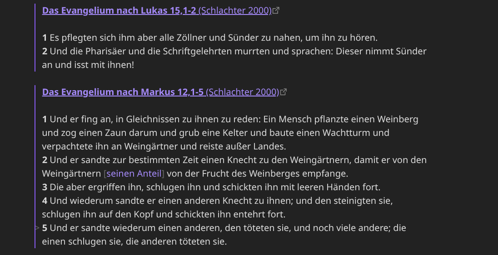
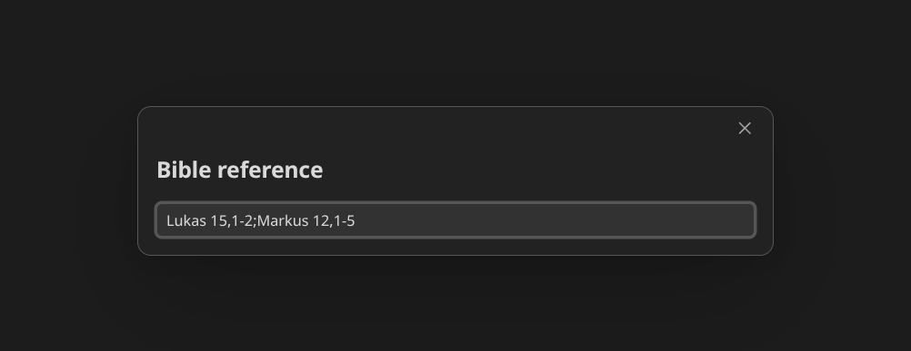

# Simple Bible Fetcher

An [Obsidian](https://obsidian.md) plugin that inserts Bible passages from the
free [bolls.life](https://bolls.life) API as Markdown quotes.

Type a reference, pick a translation, and the passage is inserted at the cursor
as a blockquote, one verse per line with a bold verse number.

```markdown
> **Das Evangelium nach Johannes 3,16** (Schlachter 2000)
>
> **16** Denn so [sehr] hat Gott die Welt geliebt, dass er seinen eingeborenen
> Sohn gab, damit jeder, der an ihn glaubt, nicht verlorengeht, sondern ewiges
> Leben hat.
```



## Features

- Insert passages via a command / hotkey.
- Reference parsing with book names, common abbreviations and book numbers
  (`Johannes 3,16`, `Joh 3,16-18`, `Ps 23`, `43 3,16`, `John 3:16`).
- Multiple references at once, separated by `;` (`Joh 3,16; Ps 23`).
- Three output formats and an optional source link.
- Every language offered by bolls.life, with the translation list and
  book-name matching following the chosen language.

## Supported languages

Every language available on bolls.life can be selected. The translation list
and book-name matching follow the chosen language, so you can type book names
as that translation writes them (for example `Juan`, `Selon Jean` or `João`).
Books can always be given by their number (1–66).

German and English additionally understand common abbreviations
(`Joh`, `1 Mos`, `Psalm`, `John`), independently of the selected translation.

## Usage

1. Open a note and place the cursor where the passage should go.
2. Run the command **Simple Bible Fetcher: Insert Bible quote** from the command
   palette (`Ctrl/Cmd+P`), or assign it a hotkey under
   **Settings → Hotkeys**.
3. Enter a reference and press `Enter`.



### Reference syntax

| Input              | Meaning                                  |
| ------------------ | ---------------------------------------- |
| `Johannes 3,16`    | single verse                             |
| `Joh 3,16-18`      | a verse range                            |
| `Joh 3,16.18`      | several single verses                    |
| `Ps 23`            | a whole chapter                          |
| `43 3,16`          | book by its number (1–66)                |
| `John 3:16`        | English style separator                  |
| `Joh 3,16; Ps 23`  | several references (also with `;`)       |

Book names are matched case-insensitively and ignore dots and spaces, so
`1. Mose`, `1 Mose` and `1mos` all resolve to the same book. The heading shows
the book name as the chosen translation writes it.

## Settings

| Setting     | Description                                              |
| ----------- | -------------------------------------------------------- |
| Language    | Translation language, and the book names recognized while typing. |
| Translation | bolls.life translation, filtered to the selected language (e.g. `S00`, `LUT`; `BSB`, `WEB`). |
| Format      | `Blockquote, bold verse number`, `One blockquote per verse`, or `Blockquote, running text`. |
| Source link | Make the heading itself link to the passage on bolls.life. |

## Installation

### Manual

Copy `main.js`, `manifest.json` and `styles.css` into
`<vault>/.obsidian/plugins/simple-bible-fetcher/` and enable the plugin under
**Settings → Community plugins**.

### From source

```bash
npm install
npm run build
```

Then copy the three files above into your vault, or symlink the project folder
into `<vault>/.obsidian/plugins/simple-bible-fetcher`.

## Development

```bash
npm install
npm run dev     # watch build
npm run build   # typecheck + production build
```

## License

GPL-3.0-or-later. See [LICENSE](LICENSE).
